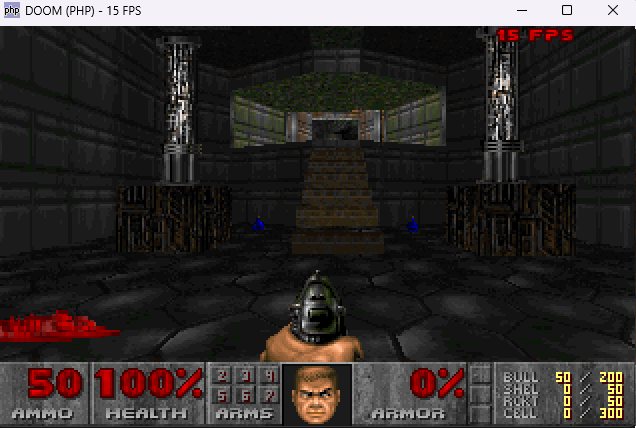

# php_doom



**Video:** [DOOM running in PHP](https://youtu.be/aCOHFTD1D8M)

DOOM generic ported from Harbour to **PHP 8.1+ CLI + SDL2** (FFI). Not a web app.

By **Wagner Nunes da Silva**

- vagucs@bol.com.br
- vagucs@vagucs.com.br
- vagucs@gmail.com
- [www.vagucs.com.br](https://www.vagucs.com.br)

This tree is a port of **[harbour_doom](https://github.com/vagucs/harbour_doom)** (`doom_hb`): the same Chocolate Doom / doomgeneric engine that first went from C to Harbour, then to Python (`doom_python`), now from Harbour to PHP.

Versão em português: [README.pt.md](README.pt.md)

---

## What this project is

The Chocolate Doom / doomgeneric engine was translated to **Harbour** (`.prg` / `.ch`) with a thin C layer for Allegro 4.2.2. That work lives at [github.com/vagucs/harbour_doom](https://github.com/vagucs/harbour_doom). This directory is the **same study piece again**, in PHP:

- Window, keys, PCM: **SDL2** through PHP **FFI** (no PECL `sdl` extension, no browser, no HTTP)
- Framebuffer: 320×200, 8-bit PLAYPAL, scaled in the window
- Game tick: 35 Hz (`TICRATE`), same as vanilla
- Renderer: BSP, visplanes, `R_DrawColumn` / `R_DrawSpan`, 16.16 `fixedMul` / `fixedDiv`
- Map: VERTEXES, LINEDEFS, SIDEDEFS, SECTORS, SEGS, SSECTORS, NODES, THINGS, BLOCKMAP, REJECT
- Play: walk, doors, lifts, switches, teleporters, exit, pickups, weapons (including chainsaw raise/cut), status bar, Tab automap, DS* sound, MUS→MIDI music, ESC menu (options, load/save), intermission tally, melt wipe, bunny scroll, monster look/chase/attack

You need a legal IWAD (shareware `doom1.wad` or commercial `doom.wad` / `doom2.wad` / etc.). This repository does not ship commercial WAD data.

It is a **complete gameplay port** of the Harbour engine into PHP (the same systems as the finished Python tree, plus teleporters and extra cheats). File count is condensed versus 100+ `.prg` files; behavior follows the Harbour sources.

Not in this tree (same cut as Harbour `boot.prg`):

- Network, CD music, joystick
- `-colors` palette quantize (Harbour-only experiment)
- Demo playback, full vanilla `info` state tables

---

## Educational purpose

This project is, above all, a **study piece**. DOOM (1993) is small enough to read end to end and dense enough to teach real engine work: BSP rendering, 16.16 fixed-point, a tic-based loop, a WAD file system.

The Harbour port taught how to read C in another language. The Python port dropped the preprocessor and 1-based arrays. The PHP port makes the next step explicit: the game still runs in an interpreter, but the native boundary is **FFI to SDL2**, not pygame and not Allegro.

What it is meant to teach:

- **Four languages, one engine.** C (`base_c/` in harbour_doom) → Harbour (`.prg`) → Python (`doom_python`) → PHP (`php_doom/src`). Same names (`P_Thrust`, `R_DrawColumn`, `A_Look`) so you can open the four versions side by side.
- **What pointers were doing.** PHP uses objects and arrays; wrap-around, BAM angles and 16.16 overflow stay explicit (`Compat::asU32`, `shar`, `fixedMul`) because PHP integers do not wrap at 32 bits. Products that overflow `int` must not go through `intdiv()`.
- **Where an interpreter is enough.** The whole game runs in PHP CLI. SDL2 is only the window, input, and PCM queue. FFI is the native boundary, like Allegro was in Harbour.
- **CLI, not HTTP.** `PHP_SAPI` must be `cli`. There is no browser canvas and no web server.
- **Legacy modernization.** Keep behavior identical, isolate the native layer, verify against the original.

Suggested way to study:

1. Run it, then read `doom.php` and `src/Game.php` — boot, tic, input.
2. Compare `src/Compat.php` with Harbour `xhb_compat.prg` / `m_fixed.prg` and Python `doom/compat.py`.
3. Open `src/Render.php` next to `r_main.prg` / `r_bsp.prg` / `r_segs.prg` / `r_draw.prg`.
4. Follow a door from **Space** through `src/Specials.php`.
5. Follow a shot from **Ctrl** in `src/Player.php` to `Collision::lineAttack` and `Enemy`.

---

## From C / Harbour / Python to PHP

PHP arrays are 0-based, like C and the Python port. Harbour arrays were 1-based; that offset is gone here.

| DOOM in C | Harbour | Python | PHP |
|---|---|---|---|
| `struct` / `typedef struct` | `CLASS ... DATA` | `@dataclass` | `class` + typed properties |
| `thing->x` | `thing:x` | `thing.x` | `$thing->x` |
| `NULL` | `NIL` | `None` | `null` |
| `array[0]` | `array[1]` | `array[0]` | `$array[0]` |
| `&`, `\|`, `^` | `hb_qbitAnd/Or/Xor` | `&`, `\|`, `^` | `&`, `\|`, `^` |
| `x >> n` unsigned | `UShr(x, n)` | `ushr(x, n)` | `Compat::ushr($x, $n)` |
| `x >> n` signed | `Shar(x, n)` | `shar(x, n)` | `Compat::shar($x, $n)` |
| 32-bit wrap | `AsU32` / `AsInt32` | `as_u32` / `as_i32` | `Compat::asU32` / `asI32` |
| `fixed_t` 16.16 | `FixedMul` / `FixedDiv` | `fixed_mul` / `fixed_div` | `Compat::fixedMul` / `fixedDiv` |
| `byte *` framebuffer | Harbour string | `bytearray` + numpy LUT | `array<int>` of 64000 + SDL ARGB8888 |
| Allegro 4.2.2 | GTALLEG / llibg | pygame | SDL2 via FFI |
| `Z_Malloc` | GC | GC | GC |
| `PUBLIC` globals | `PUBLIC` / `MEMVAR` | fields on `Game` | public fields on `Game` |
| 100+ `.prg` files | 1:1 with C | condensed `doom/*.py` | condensed `src/*.php` |

### Side-by-side: `P_Thrust`

C (`base_c/p_user.c` in harbour_doom):

```c
void P_Thrust (player_t* player, angle_t angle, fixed_t move)
{
    angle >>= ANGLETOFINESHIFT;
    player->mo->momx += FixedMul(move,finecosine[angle]);
    player->mo->momy += FixedMul(move,finesine[angle]);
}
```

Harbour (`p_user.prg`):

```harbour
PROCEDURE P_Thrust( player, angle, move )
    angle := UShr( angle, ANGLETOFINESHIFT )
    player:mo:momx += FixedMul( move, finecosine[ angle + 1 ] )
    player:mo:momy += FixedMul( move, finesine[ angle + 1 ] )
RETURN
```

Python (`doom/player.py`):

```python
def thrust(mo, angle, move):
    mo.momx += fixed_mul(move, fine_cos(angle))
    mo.momy += fixed_mul(move, fine_sin(angle))
```

PHP (`src/Player.php`):

```php
public static function thrust(Mobj $mo, int $angle, int $move): void
{
    $mo->momx += Compat::fixedMul($move, Tables::fineCos($angle));
    $mo->momy += Compat::fixedMul($move, Tables::fineSin($angle));
}
```

`->` stays `->` (like C), unsigned shift lives in `Tables::fineCos`, and the Harbour `+ 1` index offset disappears.

---

## Technology

| Layer | This port | Harbour (`harbour_doom`) |
|---|---|---|
| Language | PHP 8.1+ CLI (tested on 8.2.34) | Harbour / xHarbour |
| Window, keys, PCM | SDL2 (FFI) | Allegro 4.2.2 + GTALLEG |
| Palette blit / CRT | PHP loop → `SDL_UpdateTexture` ARGB8888 | C in `doomgeneric_allegro.prg` |
| MIDI (Windows) | winmm MCI (FFI) | Allegro MIDI / MCI |
| IWAD | same WAD lumps | same |
| Build | none (`php doom.php` or `run.bat`) | `compile.bat` / `hbmk2` |

Required PHP:

```
extension=ffi
ffi.enable=true
```

Optional: `composer install` only for PSR-4 autoload. `src/autoload.php` works without Composer.

SDL2: drop **SDL2.dll** (64-bit) in `lib/` on Windows, or set `SDL2_PATH`. See `lib/README.txt`.

---

## Performance

Typical blit rate on the same PC (320×200, windowed, shareware IWAD). The game still ticks at 35 Hz (`TICRATE`); `-fps` shows this number.

| Port | Typical FPS |
|---|---|
| Harbour (`doom_hb`) | ~12 |
| Python (`doom_python`) | ~8 |
| PHP (`php_doom`) | ~20 |
| Node (`node_doom`) | ~100 |

---

## How to run

PHP 8.1+, FFI enabled, SDL2 on the library path (or `php_doom/lib/SDL2.dll` on Windows). From this directory:

```
php doom.php
php doom.php -iwad DOOM1.WAD
php doom.php -iwad ..\DOOM1.WAD -warp 1 1 -fps
php doom.php -iwad DOOM1.WAD -crt
```

Windows (PHP zip without a `php.ini`, FFI off by default) — edit `run.bat` if your PHP is not at `C:\php-8.2.34-Win32-vs16-x64`:

```
run.bat
run.bat -fps
run.bat -iwad ..\DOOM1.WAD -warp 1 1 -crt
```

`run.bat` turns FFI on with `-d` and, if you omit `-iwad`, looks for `DOOM1.WAD` here or in the parent `doom_minimal` folder.

Linux: `sudo apt install php-cli php-ffi libsdl2-2.0-0`

macOS: `brew install php sdl2`

With no `-iwad` it looks for a `.wad` argument, then `doom1.wad` / `DOOM1.WAD` / `doom.wad` / `doom2.wad` in the current directory, `DOOMWADDIR`, this folder, and the parent `doom_minimal` folder.

---

## Keys

Classic DOOM controls (this condensed port; not remapped via `default.cfg`).

### Movement and actions

| Key | Action |
|---|---|
| Arrow keys | Forward, back, turn |
| **Shift** | Run |
| **Alt** | Strafe (hold) |
| **,** / **.** | Strafe left / right |
| **Ctrl** | Fire (hold to repeat; weapon animation + `A_ReFire`) |
| **Space** / **E** | Use / open door |
| **1** | Fist / chainsaw (toggle) |
| **2**–**7** | Pistol, shotgun, chaingun, rocket, plasma, BFG |
| **Enter** | Start from the title |
| **Tab** | Automap (toggle). **+** / **-** zoom, **0** fit map, **F** follow, **G** grid, **M** mark, **C** clear marks |
| **Esc** | Menu |
| **F2** | Save |
| **F3** | Load |
| **F11** | Toggle FPS overlay |
| **Alt+Enter** | Fullscreen |
| **+** / **-** | Screen Size (same as Options); zoom the automap while it is open. Window scale: drag the window or Alt+Enter |

Options **Screen Size** and **Graphic Detail** (HIGH/LOW) change the 3D view (`R_SetViewSize`), not the window scale.

Movement is **arrow keys only** (no WASD), so letter keys stay free for cheat codes.

### Cheats (nostalgia only)

Type these on the keyboard during play; no Enter needed:

| Code | Effect |
|---|---|
| **IDDQD** | God mode (_Degreelessness Mode_) |
| **IDKFA** | All weapons, ammo, keys, and armor |
| **IDFA** | Weapons, ammo, and armor (no keys) |
| **IDCLIP** / **IDSPISPOPD** | No clipping |
| **IDDT** | Automap cheat (type while the map is open): all walls, then things |

---

## Command-line parameters

### IWAD

| Parameter | Description |
|---|---|
| `-iwad file.wad` | IWAD to load (path or filename) |
| `file.wad` | Same thing, without `-iwad` |

### Video

| Parameter | Description |
|---|---|
| `-fullscreen` | Start in a fullscreen window |
| `-crt` | Scanline-style CRT look (Harbour `-crt` family). Clearer at window scale 2× or more |
| `-fps` | Show frames per second on the HUD (top-right) and in the window title. **F11** toggles |

### Game

| Parameter | Description |
|---|---|
| `-warp e m` | Skip the title and start episode `e` map `m` |
| `-skill n` | 0 baby … 4 nightmare (default 2, Hurt Me Plenty) |
| `-nomonsters` | Do not spawn enemies |

Harbour-only flags **not** implemented here: `-videoc`, `-scaling`, `-gfxmode`, `-colors`, `-nosound` / `-nosfx` / `-nomusic`, `-config`, net/CD/joystick.

---

## Layout

```
doom.php             entry: php doom.php
run.bat              Windows helper (FFI -d flags + default IWAD)
composer.json        PHP >=8.1, ext-ffi
src/                 engine package (namespace Doom)
src/autoload.php     PSR-4 + class aliases (no Composer required)
lib/                 drop SDL2.dll / libSDL2 here
screenshot/doom.png  README screenshot
docs/                donation QR codes
```

| Path | Vanilla / Harbour |
|---|---|
| `src/Compat.php` | `m_fixed`, `xhb_compat` |
| `src/Defs.php` | `doomdef`, `doomtype`, `doomkeys` constants |
| `src/Bin.php` | little-endian WAD / map readers |
| `src/Keys.php` | `doomkeys` / SDL keycodes |
| `src/Wad.php` | `w_wad` |
| `src/Video.php` | `i_video`, `doomgeneric_allegro` (SDL2 + `-crt`) |
| `src/VVideo.php` | `v_video` |
| `src/Tables.php` | `tables` |
| `src/RData.php` | `r_data` |
| `src/Render.php` | `r_main` `r_bsp` `r_segs` `r_plane` `r_draw` |
| `src/World.php` | `p_setup` |
| `src/Collision.php` | `p_map` `p_maputl` `p_sight` (REJECT) |
| `src/Player.php` | `p_user` `p_pspr` |
| `src/Specials.php` | `p_spec` `p_doors` `p_plats` `p_floor` `p_switch` `p_telept` |
| `src/Mobj.php` | `info` `p_inter` |
| `src/Sprites.php` | `r_things` |
| `src/Enemy.php` | `p_enemy` (look / chase / attack) |
| `src/Status.php` | `st_stuff` |
| `src/AmMap.php` | `am_map` |
| `src/Sound.php` | `i_sound`, CacheSFX, MCI music on Windows |
| `src/Mus2Mid.php` | `mus2mid.c` |
| `src/Menu.php` | `m_menu` |
| `src/Saveg.php` | `p_saveg` (24-byte name + JSON) |
| `src/WiStuff.php` | `wi_stuff` |
| `src/Wipe.php` | `f_wipe` melt |
| `src/Finale.php` | `f_finale` (text + bunny scroll) |
| `src/Game.php` | `d_main` `g_game` `d_loop` `boot` |

---

## Lineage

1. **id Software DOOM** (1993) — original engine
2. **Chocolate Doom / doomgeneric** — portable C
3. **[harbour_doom](https://github.com/vagucs/harbour_doom)** — Harbour + Allegro 4.2.2 (`Doom_hb.exe`)
4. **doom_python** — Python + pygame, from that Harbour port
5. **This tree** — PHP 8 CLI + SDL2 FFI, sourced from the same Harbour gameplay (100% of gameplay intent from the `.prg` files; condensed file count)

---

## Donate

### Ethereum

`0x1b64038A2b1DB73ABd0068d8B9B0d1dC5a90C5F1`


### PIX

Key: `vagucs@bol.com.br`


